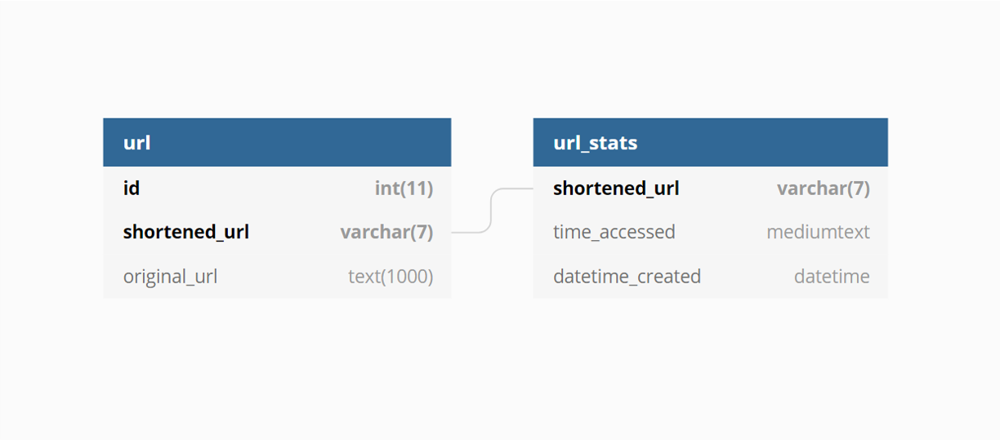

# URL Shortener

<!-- TOC -->

- [URL Shortener](#url-shortener)
  - [Host](#host)
  - [Database Design](#database-design)
    - [Diagram](#diagram)
- [API](#api)
  - [Short URLs](#short-urls)
    - [Endpoint](#endpoint)
    - [Request Method](#request-method)
    - [Parameters](#parameters)
    - [Response](#response)
  - [Show all URLs](#show-all-urls)
    - [Endpoint](#endpoint-1)
    - [Request Method](#request-method-1)
    - [Response](#response-1)
  - [Show URL stats by Hash](#show-url-stats-by-hash)
    - [Endpoint](#endpoint-2)
    - [Request Method](#request-method-2)
    - [Parameters](#parameters-1)
    - [Response](#response-2)
  - [Show URL stats by original URL](#show-url-stats-by-original-url)
    - [Endpoint](#endpoint-3)
    - [Request Method](#request-method-3)
    - [Parameters](#parameters-2)
    - [Response](#response-3)
  - [URL Redirect](#url-redirect)
    - [Endpoint](#endpoint-4)
    - [Request Method](#request-method-4)
    - [Parameters](#parameters-3)
    - [Response](#response-4)

<!-- /TOC -->

---

## Host

    example.com

---

## Database Design

### Diagram



---

# API

## Short URLs

### Endpoint

    /shorten

### Request Method

    POST

### Parameters

JSON body

| Name | Type   | Desc                                                   |
| ---- | ------ | ------------------------------------------------------ |
| url  | string | url for Shortener, e.g. "https://xxxx.com/query_param" |

### Response

Success

```json
{
  "success": true,
  "message": "",
  "data": [
    {
      "url": "https://xxxx.com/query_param",
      "shorten_url": "https://example.com/xXyYzZ"
    }
  ]
}
```

Fail

```json
{
  "success": false,
  "message": "Error message",
  "data": []
}
```

---

## Show all URLs

### Endpoint

    /stats

### Request Method

    GET

### Response

Success

```json
{
  "success": true,
  "message": "",
  "data": [
    {
      "url": "https://xxxx.com/query_param",
      "shortened_url": "https://example.com/zzzzzzz",
      "datetime_created": "09/06/2021 11:45:01"
    },
    {
      "url": "https://xxxx.com/query_param",
      "shortened_url": "https://example.com/yyyyyyy",
      "datetime_created": "09/06/2021 11:45:01"
    },
    {
      "url": "https://xxxx.com/query_param",
      "shortened_url": "https://example.com/xxxxxxx",
      "datetime_created": "09/06/2021 11:45:01"
    }
  ]
}
```

Fail

```json
{
  "success": false,
  "message": "Error message",
  "data": []
}
```

---

## Show URL stats by Hash

### Endpoint

    /stats/{url_hash}

### Request Method

    GET

### Parameters

URL Param

| Name     | Type   | Desc                                     |
| -------- | ------ | ---------------------------------------- |
| url_hash | string | 7 characters hash, e.g. "/stats/aBc1234" |

### Response

Success

```json
{
  "success": true,
  "message": "",
  "data": [
    {
      "url": "https://xxxx.com/query_param",
      "shortened_url": "https://example.com/aBc1234",
      "datetime_created": "09/06/2021 11:45:01",
      "number_of_clicks": 3,
      "datetime_accessed": [
        "09/06/2021 11:44:56",
        "09/06/2021 11:45:00",
        "09/06/2021 11:45:01"
      ]
    }
  ]
}
```

Fail

```json
{
  "success": false,
  "message": "Error message",
  "data": []
}
```

---

## Show URL stats by original URL

### Endpoint

    /stats/find

### Request Method

    POST

### Parameters

JSON body

| Name | Type   | Desc                                              |
| ---- | ------ | ------------------------------------------------- |
| url  | string | original url, e.g. "https://xxxx.com/query_param" |

### Response

Success

```json
{
  "success": true,
  "message": "",
  "data": [
    {
      "url": "https://xxxx.com/query_param",
      "shortened_url": "https://example.com/zzzzzzz",
      "datetime_created": "09/06/2021 11:45:01",
      "number_of_clicks": 3,
      "datetime_accessed": [
        "09/06/2021 11:44:56",
        "09/06/2021 11:45:00",
        "09/06/2021 11:45:01"
      ]
    }
  ]
}
```

Fail

```json
{
  "success": false,
  "message": "Error message",
  "data": []
}
```

---

## URL Redirect

### Endpoint

    /{url_hash}

### Request Method

    GET

### Parameters

URL Param

| Name     | Type   | Desc                               |
| -------- | ------ | ---------------------------------- |
| url_hash | string | 7 characters hash, e.g. "/aBc1234" |

### Response

Success

> Will be redirected to original URL

Fail

> Will return a blank page

---
